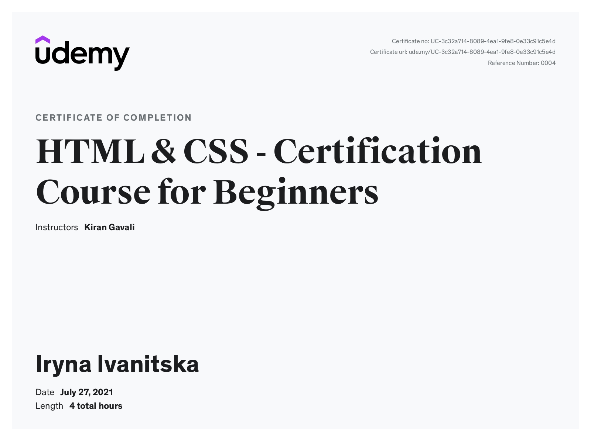
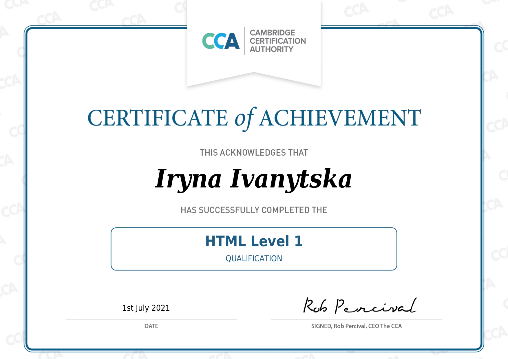
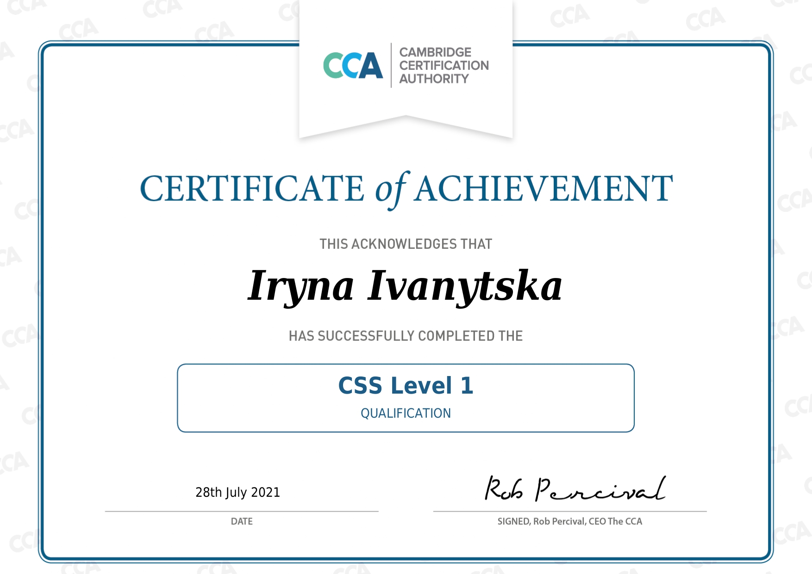

# Iryna Ivanytska
***

## My Contact Info

* **Country:** Ukraine
* **City:** Uzhgorod
* **Phone number:** +38 (050) 505 3922
* **E-mail:** ira.pechenitsya@gmail.com
* **Facebook:** [Profile](https://www.facebook.com/irina.ivanytskaya)
* **LinedIn:** [Profile](https://www.linkedin.com/in/iryna-ivanytska)

***

## About Me
I am a Junior Web Developer from Ukraine. I want to work in team to learn new programming languages and tools. That's why I currently learning to get a job offer from a company. I like to travel and read books.

### Skills
* HTML
* CSS
* Bootstrap
* SaSS
* JavaScript (in learning progress)
* ReactJS, Redux (in learning progress)
* CMS: Wordpress, Opencart
* Figma
* VSCode

### Code examples
```javascript
function friend(friends){
  let newFriends = [];
  for (let i = 0; i < friends.length; i++) {
    if (friends[i].length == 4) {
      newFriends.push(friends[i]);
    }
  }
  return newFriends;
}
```

### Work experience
**2017-2021** - freelancer. Wordpress and Opencart sites developer.

### Education and courses
1. **2007-2012** - Uzhgorod National University, Master's degree in Mathematics and Informatics
1. **2017** - CS50's Introduction to Computer Science - finished course
1. **2018-2021** - Udemy 
   * HTML & CSS - Certification Course for Beginners
   * The Complete Web Developer Course 2.0 (in progress)

### Languages
- Ukrainian (native)
- Hungerian
- Russian
- English

### Сertificates




